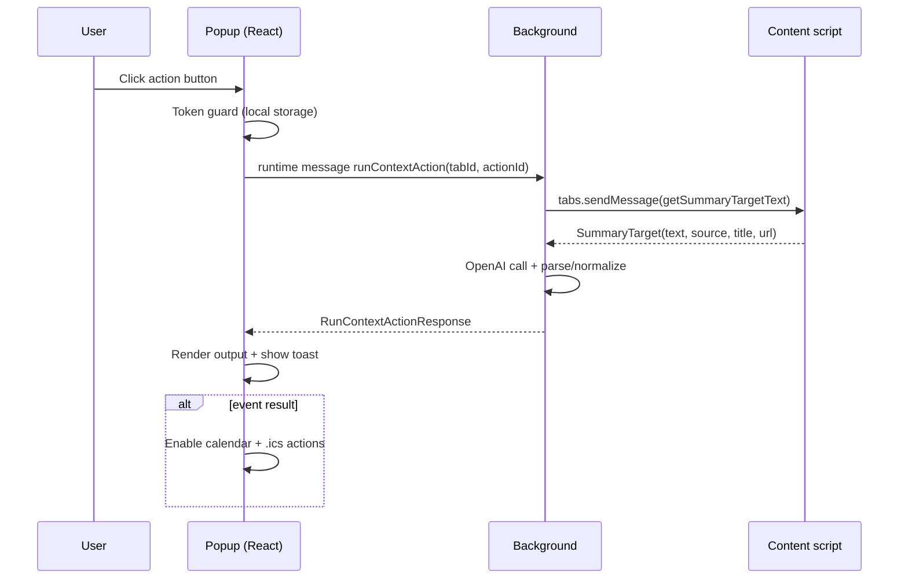
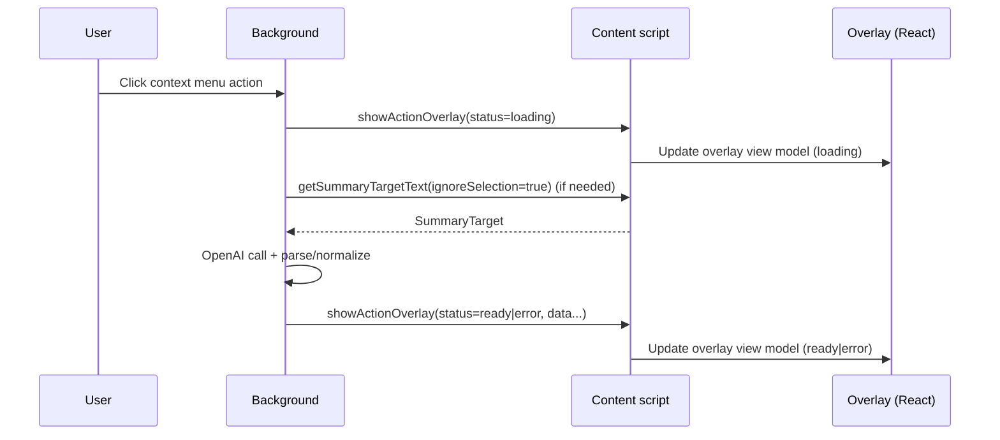

# Technical Design: react-base-ui-refresh

> Note: `.kiro/settings/templates/specs/design.md` and `.kiro/settings/rules/design-principles.md` were not found in this repository. This document uses a structured fallback format while preserving the required section headings.

## 1. Overview

### 1.1 Goals (from requirements)
- Refresh the Popup UI and the in-page overlay UI by replacing the UI layer with React and Base UI (`@base-ui/react`) while preserving existing functionality and runtime boundaries. (1, 2)
- Preserve the popup’s 3-pane information architecture (Actions / Table / Settings) and layout intent (pane structure, sizing, scroll regions). (1, 3)
- Keep overlay isolation and stability across arbitrary sites (Shadow DOM, no CSS leakage, predictable portals). (8, 9)
- Maintain quality gates: build, lint, and tests. (12)

### 1.2 Non-goals
- Changing background-service-worker responsibilities (OpenAI calls remain in background). (4, 11)
- Introducing a backend service or new data persistence model. (1, 11)
- Rewriting unrelated logic beyond what is required to support the new UI layer.

## 2. Discovery Summary (Light)
This is an **extension / integration** feature. Discovery focused on:
- Current repository boundaries (popup/content/background) and message flows.
- Base UI support for Shadow DOM + portal scoping and toast notifications.

Details and sources are recorded in `.kiro/specs/react-base-ui-refresh/research.md`.

## 3. Architecture Pattern & Boundary Map

### 3.1 High-level architecture
The extension remains a Manifest V3 system with **three runtime surfaces**:
- **Popup**: UI + settings surface (React + Base UI).
- **Content script**: table sorting + in-page overlay (React + Base UI in Shadow DOM).
- **Background service worker**: privileged APIs, context menus, OpenAI API calls, orchestration.

```mermaid
flowchart LR
  subgraph Popup[Popup (extension document)]
    PUI[React UI (Base UI components)]
    PServices[Popup services\n(storage + messaging)]
  end

  subgraph BG[Background service worker]
    BMsg[chrome.runtime.onMessage\nhandlers]
    OpenAI[OpenAI client]
    Menus[Context menu refresh/click]
  end

  subgraph Page[Host page]
    CS[Content script\n(table sort + message handlers)]
    OHost[Overlay host\n(ShadowRoot)]
    OUI[Overlay React UI\n(Base UI + custom layout)]
  end

  PUI --> PServices
  PServices -->|runtime message| BG
  PServices -->|tab message| CS
  BG -->|tab message| CS
  CS --> OHost --> OUI
  CS -->|runtime message| BG
  BG --> OpenAI
  BG --> Menus
```

### 3.2 Architectural pattern
- **UI as a thin layer**: React components render and orchestrate user interactions, but business logic remains in small typed services/modules.
- **Typed message contracts**: discriminated unions remain the boundary between runtimes (popup ↔ background, background ↔ content).
- **Shadow DOM isolation for overlay**: overlay is rendered inside a ShadowRoot; Base UI portals are explicitly scoped to that ShadowRoot. (9)

## 4. Technology Stack & Alignment

### 4.1 New/updated dependencies (UI layer)
- `react` + `react-dom` for popup and overlay UIs. (2)
- `@base-ui/react` for accessible UI primitives (Tabs, Dialog, Select, Toast, Tooltip, etc.). (2, 13)

### 4.2 Build and typecheck alignment
The repository uses `esbuild` bundling and TypeScript `strict`.
Design expectations:
- TypeScript config enables JSX typing for `.tsx` modules (e.g., `jsx: react-jsx`). (12)
- ESLint and Vitest configurations include `.tsx` where needed. (12)
- Bundling remains IIFE outputs into `dist/` to preserve manifest integration and `popup_bootstrap.js` loading. (12)

### 4.3 Styling strategy alignment (unstyled primitives)
Base UI is unstyled; the design introduces:
- A small token system (CSS variables) for both popup and overlay.
- A strict separation:
  - Popup visuals live in `popup.css` (document-level CSS).
  - Overlay visuals live inside the overlay ShadowRoot (injected `<style>` or adopted stylesheet), preventing leakage. (9)
- Root stacking context: apply `isolation: isolate` in popup root and overlay root to keep portal layering predictable. (2, 9)

## 5. Components & Interface Contracts

### 5.1 Shared types (no `any`)
The design keeps and extends existing shared types.

```ts
export type SummarySource = 'selection' | 'page';

export type ContextActionKind = 'text' | 'event';
export type ContextAction = {
  id: string;
  title: string;
  kind: ContextActionKind;
  prompt: string;
};

export type ExtractedEvent = {
  title: string;
  start: string;
  end?: string;
  allDay?: boolean;
  location?: string;
  description?: string;
};
```

### 5.2 Message contracts (runtime boundaries)
To preserve stability, message `action` strings and response shapes remain compatible with the current system. (4, 6, 8, 11)

```ts
// Popup -> background
export type PopupToBackgroundMessage =
  | { action: 'runContextAction'; tabId: number; actionId: string }
  | { action: 'testOpenAiToken'; token?: string };

export type RunContextActionResponse =
  | { ok: true; resultType: 'text'; text: string; source: SummarySource }
  | { ok: true; resultType: 'event'; event: ExtractedEvent; eventText: string; calendarUrl: string; source: SummarySource }
  | { ok: false; error: string };

// Background/popup -> content script
export type ContentMessage =
  | { action: 'enableTableSort' }
  | { action: 'showNotification'; message: string }
  | { action: 'getSummaryTargetText'; ignoreSelection?: boolean }
  | {
      action: 'showActionOverlay';
      status: 'loading' | 'ready' | 'error';
      mode: 'text' | 'event';
      source: SummarySource;
      title: string;
      primary?: string;
      secondary?: string;
      calendarUrl?: string;
    }
  | {
      action: 'showSummaryOverlay';
      status: 'loading' | 'ready' | 'error';
      source: SummarySource;
      summary?: string;
      error?: string;
    };
```

### 5.3 Storage contracts
Storage placement remains aligned with product/tech steering. (7, 11)

```ts
export type SyncStorageData = {
  domainPatterns?: string[];
  autoEnableSort?: boolean;
  contextActions?: ContextAction[];
};

export type LocalStorageData = {
  openaiApiToken?: string;
  openaiCustomPrompt?: string;
  selectedText?: string;
  selectedTextUpdatedAt?: number;
};
```

### 5.4 UI service interfaces (typed, testable)
The React UI layer calls a small set of services so tests can mock behavior without relying on DOM structure. (12)

```ts
export type PopupRuntime = {
  getActiveTabId: () => Promise<number | null>;
  runContextAction: (tabId: number, actionId: string) => Promise<RunContextActionResponse>;
  enableTableSort: (tabId: number) => Promise<{ success: boolean }>;
  testOpenAiToken: (token?: string) => Promise<{ ok: true } | { ok: false; error: string }>;
};
```

## 6. Popup Design (React + Base UI)

### 6.1 Layout invariants (preserve “skeleton”)
- 3-pane structure remains: `pane-actions`, `pane-table`, `pane-settings`. (1, 3)
- Scroll behavior remains: the content body is scrollable per pane where applicable. (1)
- Sidebar and drawer semantics remain (rail + drawer for navigation). Visual styling may change. (1, 3)

### 6.2 Navigation and drawer
**Tabs**:
- Use Base UI `Tabs` as the canonical navigation state for the three panes. (3, 13)
- Maintain URL-hash parity by synchronizing `Tabs` value ↔ `location.hash`:
  - On mount, derive initial tab from hash.
  - On tab change, update hash.

**Drawer**:
- Use Base UI `Dialog` to implement the “menu drawer” on narrow widths or when invoked by the menu button. (3, 13)
- `Dialog` provides:
  - Scrim click to close. (3)
  - Escape to close. (3)
  - Focus trapping and return-focus behavior. (13)

### 6.3 Actions pane
Responsibilities (preserve behaviors): (4, 5)
- Load actions from `chrome.storage.sync` (with normalization and defaults).
- Render one trigger per action.
- Execute action via background `runContextAction` (never call OpenAI directly).
- Render results:
  - Text result into read-only output area.
  - Event result into output area + calendar controls.
- Provide “Copy”, “Google Calendar”, and “.ics” actions when applicable.
- Display action input source indicator (“選択範囲” / “ページ本文”).
- Maintain the action editor (title/kind/prompt) with save/clear/reset and delete.

Base UI components used:
- `Field` + `Input`/`Textarea` for form semantics. (13)
- `Select` for action kind (`text` / `event`). (5, 13)
- `Toast` for success/error notifications (copy success/failure, save errors, invalid background response). (4, 11)

### 6.4 Table pane
Responsibilities (preserve behaviors): (6, 10)
- “Enable table sort” sends `{ action: 'enableTableSort' }` to the active tab.
- “Auto enable sort” is persisted in sync storage.
- URL pattern add/remove persists to sync storage and updates the list.

### 6.5 Settings pane (OpenAI)
Responsibilities (preserve behaviors): (7, 11)
- Store token in `chrome.storage.local` only.
- Store custom prompt in `chrome.storage.local`.
- Token visibility toggle changes input masking only.
- Token test is performed via background `testOpenAiToken`.
- Token guard integration:
  - On missing token during action execution, notify and navigate to Settings and focus the token input. (7)

## 7. Content Script Overlay Design (React + Base UI in Shadow DOM)

### 7.1 Mounting and idempotency
The overlay remains Shadow DOM-mounted for CSS isolation. (9)

Design contract:
- One host element (stable id, e.g., `my-browser-utils-overlay`) exists at most once.
- One React root exists at most once per page.
- A global guard (host id + an attached property on the host or a `globalThis` symbol) prevents double-mount. (9, 12)

### 7.2 Overlay view model
The overlay UI is driven by a single view model updated by incoming `showActionOverlay` / `showSummaryOverlay` messages. (8)

```ts
export type OverlayStatus = 'loading' | 'ready' | 'error';
export type OverlayMode = 'text' | 'event';

export type OverlayViewModel = {
  open: boolean;
  title: string;
  status: OverlayStatus;
  mode: OverlayMode;
  source: SummarySource;
  primary: string;
  secondary: string;
  calendarUrl: string;
  pinned: boolean;
  anchorRect: { left: number; top: number; width: number; height: number } | null;
  position: { left: number; top: number } | null; // used when pinned or when anchor is absent
};
```

### 7.3 Positioning and pinning
- When `source === 'selection'`, compute an anchor rect from the current selection and position the overlay near it. (8)
- If the user drags the overlay, set `pinned = true` and switch to fixed `position` with viewport clamping. (8, 9)
- If pinned, ignore subsequent anchor updates unless the user unpins. (8)

### 7.4 Overlay actions and notifications
Overlay UI actions: (8)
- Copy primary text (or event text) to clipboard.
- For event results:
  - Open calendar URL in a new tab.
  - Copy calendar URL.
  - Offer `.ics` download if provided by the system (or derived in popup for parity).
- Close overlay.

Notification surface:
- Use Base UI `Toast` within the ShadowRoot for copy success/failure and error feedback. (8, 11)
- Keep existing lightweight, non-overlay notifications (e.g., table-sort activation) as page-level toasts, as they are not part of the overlay subtree.

### 7.5 Portal scoping inside Shadow DOM
Any Base UI component that portals (e.g., `Toast.Portal`, `Dialog.Portal`, `Tooltip.Portal`) must set `container` to the overlay ShadowRoot (or a dedicated portal root inside it). (2, 9)

## 8. Data Flow and Sequences

### 8.1 Popup action execution


### 8.2 Context menu execution (overlay-first)


## 9. Error Handling Strategy
Aligned with steering: fail loudly but safely; prefer typed results at boundaries. (4, 11)
- Popup and overlay UIs surface errors via Toast notifications and/or inline error states.
- Message boundary failures (missing response, runtime errors) render a safe fallback (empty output and a notification). (4)

## 10. Accessibility & Keyboard Support
Primary approach: rely on Base UI’s accessible behaviors and ensure consistent focus styling. (13)
- Tabs provide keyboard navigation (arrow keys / Tab focus order).
- Dialog-based drawer supports Escape close, focus trap, return focus.
- All icon-only buttons have accessible names (`aria-label`) and visible focus indicators.
- Overlay primary actions (copy/open calendar/download/close) are keyboard reachable and labeled. (13)

## 11. Testing & Validation

### 11.1 Automated tests (Vitest + jsdom)
Maintain and update the existing test suite to assert behaviors rather than exact DOM structure. (12)
- Popup navigation: switching panes updates active state and hash. (3, 12)
- Token guard: missing token triggers navigation + focus and blocks action execution. (7, 12)
- Copy failure paths: clipboard errors produce an error notification and do not corrupt state. (4, 12)
- Overlay idempotency: repeated initialization/mount attempts yield a single overlay instance. (9, 12)

### 11.2 Manual verification (Chrome + DevTools)
Use Chrome DevTools (via MCP) to validate:
- Focus order, keyboard operability, accessibility tree for popup and overlay. (13)
- Portal placement and CSS isolation in Shadow DOM for overlay. (2, 9)
- Layout invariants (pane structure/sizing/scroll regions). (1)

## 12. Migration and Rollout Plan
To minimize regression risk:
1) Introduce React root mounting while keeping existing storage/message services intact.
2) Replace popup DOM UI with React panes one-by-one while preserving storage keys and message actions.
3) Replace overlay DOM renderer with a ShadowRoot-mounted React overlay driven by the existing message actions.
4) Update tests to the new UI layer and ensure `pnpm run build`, `pnpm run lint`, and `pnpm test` remain green. (12)

## 13. Requirements Traceability
Mapping from requirements (by numeric heading) to design sections:

| Requirement | Design coverage |
|---:|---|
| 1 | Sections 1, 6.1, 7.1, 12 |
| 2 | Sections 4, 6, 7.5 |
| 3 | Sections 6.2, 8.1, 11.1 |
| 4 | Sections 6.3, 8.1, 9 |
| 5 | Section 6.3 |
| 6 | Sections 6.4, 8.1 |
| 7 | Section 6.5, 9 |
| 8 | Sections 7.2–7.4, 8.2 |
| 9 | Sections 7.1, 7.5, 11.1 |
| 10 | Sections 6.4, 7.1, 12 |
| 11 | Sections 5.3, 8, 9 |
| 12 | Sections 4.2, 11, 12 |
| 13 | Sections 6.2, 10 |

